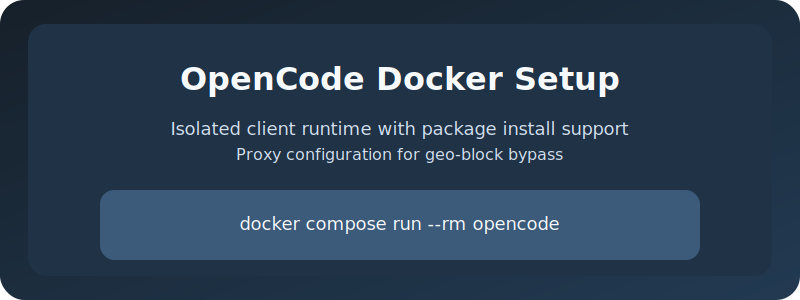
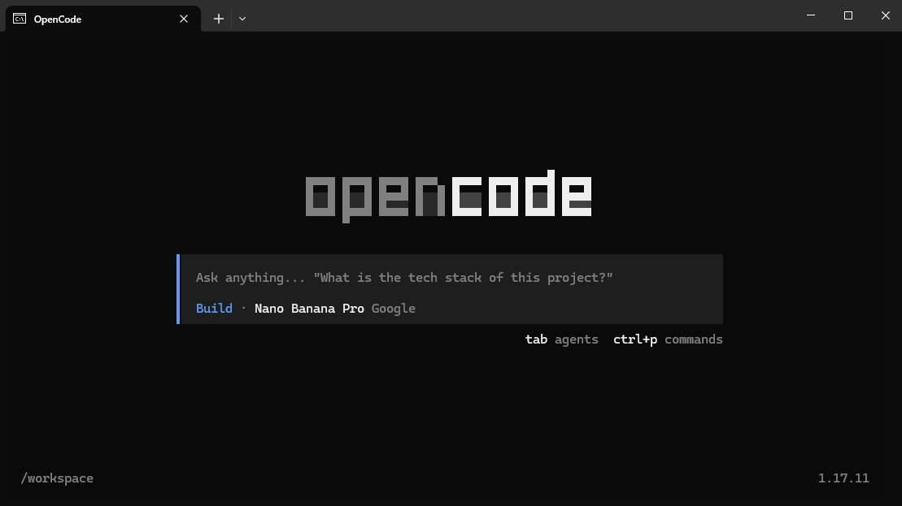

# OpenCode Docker

OpenCode Docker provides an isolated Docker environment for running the OpenCode client. It enables installing required packages inside the container and supports proxy configuration to bypass geo-restrictions.

## Requirements
- Windows
- Docker Hub
-  (cmd, powershell - Ctrl c and Ctrl v don't work)

## Features
- Runs the OpenCode client inside an isolated Docker container
- Builds a reproducible environment using `Dockerfile` and `docker compose`
- Supports proxy-based access via `.env` and `http(s)_proxy` variables
- Maps the host workspace into the container for seamless development

## Getting Started
1. Copy `.env.example` to `.env`
2. Fill in your API keys and proxy settings
3. Run `build.bat` or `build_no_cache.bat` to build the Docker image
4. Use `run.bat` to start the OpenCode client in the container
5. Use `sh.bat` to attach to the running container shell

## Configuration
- `PATH_WINDOWS_TERMINAL` points to your Windows Terminal executable
- `PATH_FOLDER_WORKSPACE` maps the host folder into `/workspace` inside the container
- `USE_PROXY=true` enables proxy environment variables for container traffic
- `PROXY_SERVER` defines the proxy endpoint used to bypass geo-blocking

## Scripts
### `build_no_cache.bat`
Builds the Docker Compose image from scratch without using cache. Use this when you need a clean rebuild after dependency or environment changes.

### `build.bat`
Builds the Docker Compose image using Docker cache. This is faster for normal rebuilds and development iterations.

### `run.bat`
Loads environment variables from `.env` and launches `docker compose run --rm opencode` in Windows Terminal. It starts the OpenCode client inside an isolated container.

### `sh.bat`
Finds the running OpenCode container and opens an interactive `sh` shell inside it. The script shows connection status and waits until you exit the container.
